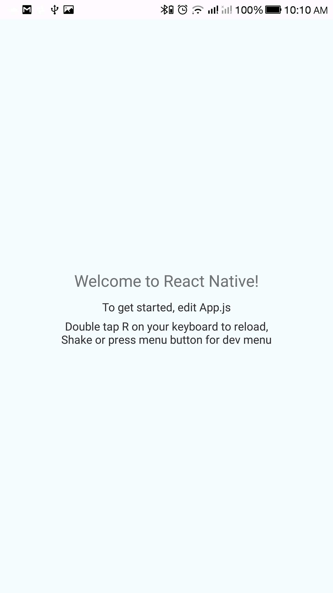

## React Native - testeng ze watres :boat:

Just following [the docs](https://facebook.github.io/react-native/docs/running-on-device) here on how to get this boat anchor named react onto a native device.

---
### Short term goalz:

- Get this thing running in a hello world capacity on an android device
  - Not using Expo CLI cause that's for brainlets
- See if we can handle simple touch interactions within react's state management
- Try to get all this wrapped into an .apk I can deploy onto the device, either automatically or via good ole capy peste

Woot! Got the hello world working. Looks like the $ANDROID_HOME env var
wasn't automatically detected by android studio so I had to manually put
it into `android/local.properties`. You need the full path, which is lame.
Did it via a USB cable connection to my laptop (no emulator in android
studio.) Here it is:

Next stop is to figure out how to do it over wifi so I don't drain my
battery.

### Long term goalz:

- See if we can use cordova or some other API to get access to device hardware like camera and gp-essay
- See if we can create a development .api and maybe provisioning profile to run this on a turd iOS device

### Stretch goalez:

- See what it'd take to get a cert in place and deployed onto googer store
- See what the monetization path would look like to actually generate something that might make me less poor one day
